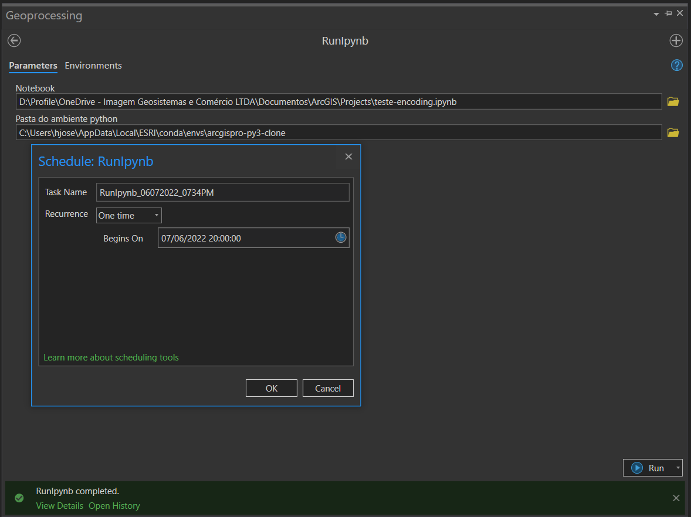

# Toolbox to run jupyter notebooks using arcgis pro
### Use it to schedule notebooks.
### Windows only

### Toolbox

### Export supported formats:
 - html
 - html_ch
 - html_embed
 - html_toc
 - markdown
 - notebook
 - pdf
 - python
 - script

### To use markdown and pdf
YOU MUST INSTALL pandoc and miktex:
 * Tested with pandoc-2.19.2
 * Tested with basic-miktex-22.10-x64