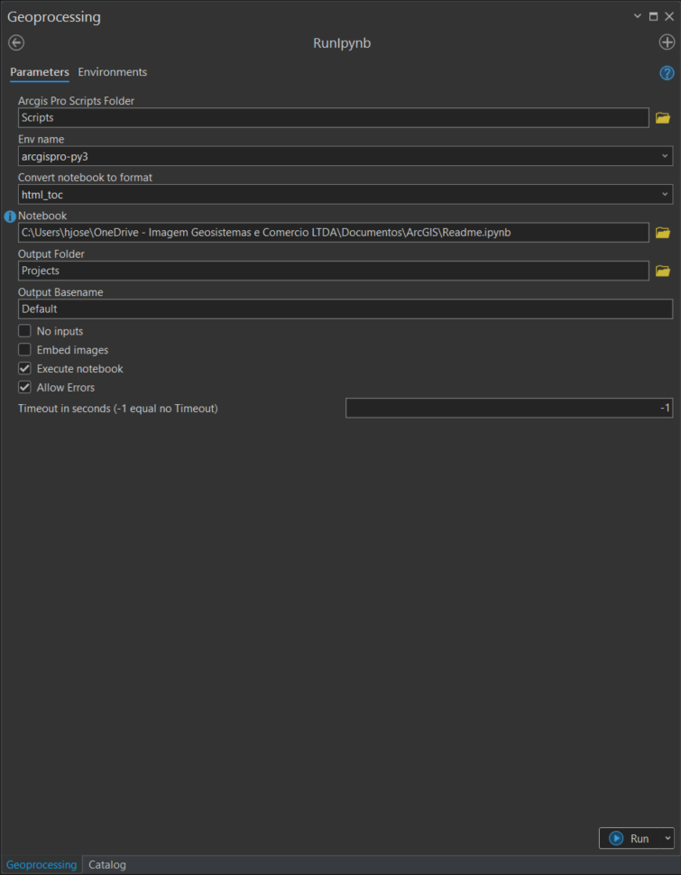

# Toolbox to run jupyter notebooks using arcgis pro
### Use it to schedule notebooks.

### To find your arcgis pro env, type windows+x, Python Command Prompt.
### It will show your current active env in arcgis pro, copy that 

